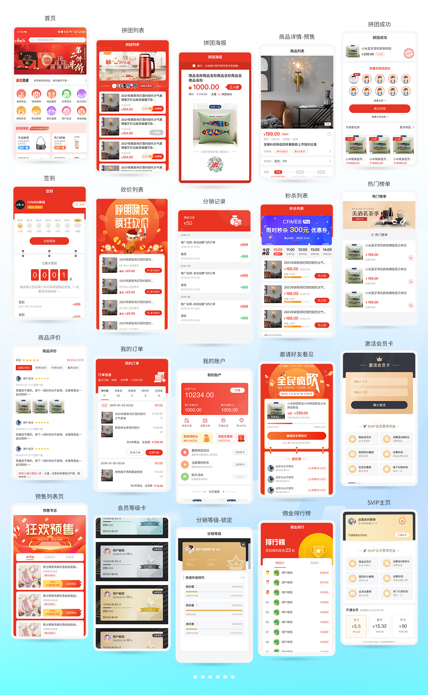
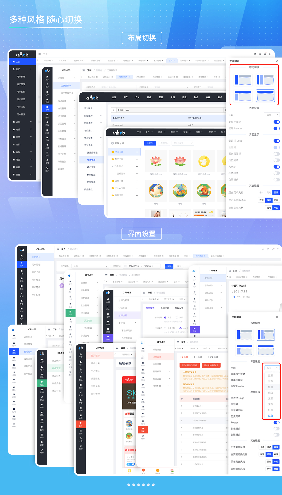

    

CRMEB开源商城系统（PHP版）

    <a href='https://gitee.com/ZhongBangKeJi/CRMEB/stargazers'>
       </img>
    </a>
    
    
     

  用心做开源，我们也很需要你的鼓励！右上角Star🌟，等你点亮！

####

[官网](https://www.crmeb.com/) |
[在线体验](http://v4.crmeb.net/admin/) |
[帮助文档](https://doc.crmeb.com/single/v54/) |
[应用市场](https://www.crmeb.com/market/) |
[技术社区](https://www.crmeb.com/ask/)

[comment]: <> ([宽屏预览]&#40;https://gitee.com/ZhongBangKeJi/CRMEB/blob/master/README.md&#41;)

<a href="https://gitee.com/ZhongBangKeJi/CRMEB/blob/master/README.md">宽屏预览</a>

---

### 📝 **项目介绍**

**开源自由**  
CRMEB开源商城系统代码100%开源，基于 **Apache-2.0协议** 免费商用，无任何隐藏费用或功能限制，真正实现“零成本”部署与二次开发自由！

**技术架构**  
采用 **ThinkPHP 6 + ElementUI + UniApp** 技术栈，前后端分离设计，支持模块化开发与高效维护。前端适配微信小程序、H5、APP、PC等多端，后端统一管理全平台数据，保障流畅体验与高并发性能。

**全场景覆盖**  
无缝对接公众号、小程序、H5、APP、PC端，数据实时互通，助力商家一站式运营多渠道业务，满足全场景电商需求。

**原生营销引擎**  
内置 **20+核心营销模块**（拼团、砍价、秒杀、优惠券、积分体系、直播带货、付费会员、等级会员、用户充值、分销裂变、渠道码、新人礼等），支持零插件自定义活动规则。通过 **首页DIY功能** ，商家可拖拽式设计商城首页，无需技术背景即可快速搭建高转化场景，实现「所见即所得」的运营效率。

**社区共建计划**  
我们致力于打造开发者友好生态，开放源码、持续更新功能模块，并欢迎开发者提交优化建议或贡献代码。通过共享技术成果，降低行业重复造轮子成本，推动开源电商系统的可持续发展。

🌟 **立即体验**：访问官网下载，参与社区讨论，共同完善CRMEB开源商城！  
🔗 功能列表 | 📩 <a href="https://gitee.com/ZhongBangKeJi/CRMEB/issues" target="_blank">提交反馈</a> | 📩 <a href="https://gitee.com/ZhongBangKeJi/CRMEB/pulls" target="_blank">提交代码</a>

---

### 🫧 技术特点

~~~
关于二开：
1.代码规范：遵循PSR-2命名规范、Restful标准接口、代码严格分层、注释齐全、统一错误码；
2.权限管理：内置强大灵活的权限管理，可以控制到每一个菜单；
3.开发配置：低代码增加配置、系统组合数据模块；
4.代码生成：快速生成后台菜单、页面，快速实现增删改查；
5.定时任务：系统内置10中定时任务，还有自定义任务，可以自行设置执行周期，执行代码，完美兼容；
6.系统事件：埋入30+系统事件锚点，可在后台页面进行事件添加；
7.在线编辑：可以在后台对系统的代码进行编辑修改操作，不用登录服务器去修改代码文件，方便快捷；
8.接口管理：后台页面可以看到系统中所有的接口数据，并且可以在线调试接口；
9.二开效率：应用form-builder PHP可以快速生成表单；
10.快速上手：后台接口管理、后台数据库字典、系统文件管理备注、代码注释、一键安装；
~~~
~~~
性能与拓展：
1.系统安全：系统操作日志、系统生产日志、文件校验、数据备份；
2.高性能：支持Redis缓存、队列、长连接、多种云储存、支持集群部署；
3.多语言：支持自动识别浏览器多语言展示；
4.驱动扩展：支持多种支付方式、多种短信、多种云储存等；
5.云存储：云存储支持图片和视频的远程云存储，支持阿里云，腾讯云，七牛云，京东云，天翼云，华为云
6.一号通：通用的第三方扩展，支持短信，物流查询，电子面单，电子发票，商品采集，商家寄件
~~~

---

### **CRMEB 开源版运行环境要求**

| **类别**         | **要求**                                                                 |
|------------------|------------------------------------------------------------------------|
| **操作系统**     | Linux / Windows                                                        |
| **WEB 服务**   | Nginx / Apache / IIS                                                      |
| **PHP 版本**     | PHP 7.1 ~ 7.4                                                          |
| **数据库**       | MySQL 5.7 ~ 8.0（引擎：InnoDB）                                         |
| **缓存**         | Redis（可选，不安装则使用文件缓存）                                      |
| **管理器**       | Supervisor（用于管理消息队列）                                          |
| **推荐工具**     | 宝塔面板（简单易用）                                                    |
| **云服务器**     | 阿里云 ECS / 腾讯云 CVM / 京东云ECS                                                |
| **开放端口**     | 80, 21, 8888, 888, 443, 3306, 6379（授权对象：`0.0.0.0/0`）              |
| **PHP 扩展**     | fileinfo（可选）、redis（可选）                               |
| **禁用函数**     | `proc_open`, `pcntl_signal`, `pcntl_signal_dispatch`, `pcntl_fork`, `pcntl_wait`, `pcntl_alarm` |
| **消息队列**     | 运行命令：`php think queue:listen --queue`    （使用Supervisor）                          |
| **长连接**       | 运行命令：`sudo -u www php think workerman start --d`     （命令行执行）              |
| **定时任务**     | 运行命令：`php think timer start --d`            （命令行执行）                       |
> 温馨提示：虚拟空间不支持，推荐使用bt宝塔面板，服务器推荐京东云服务器：<a href="https://partner.jdcloud.com/partner/notice/b06c3232b6394fdfa496923b8e00b286" target="_blank">注册即享6.5折专属优惠，点我领取！</a>

---

### **开发环境：**
| 工具          | 版本               | 下载链接                                                                 |
|--------------|--------------------|-------------------------------------------------------------------------|
| **PHP**      | 7.1-7.4            | [PHP 官方下载](https://www.php.net/downloads.php)                           |
| **MySQL**    | 5.7                | [MySQL 官网](https://www.mysql.com/)                                       |
| **Redis**    | 7.0                | [Redis 官网](https://redis.io/download)                                     |
| **Nginx**    | 1.22               | [Nginx 官网](http://nginx.org/en/download.html)                             |
| **Apache**   | 2.4                | [Apache HTTP Server](https://httpd.apache.org/download.cgi)              |
| **Node.js**  | 14/18              | [Node.js LTS 版本](https://nodejs.org/en/download/releases/)                |

---

### 后端技术栈
| **技术**            | **功能/用途**                                                                 | **地址**                                                                 |
|---------------------|-----------------------------------------------------------------------------|-------------------------------------------------------------------------|
| `php扩展库`          | PHP 基础运行环境，JSON 数据处理，高精度数学计算等                                | https://www.php.net/                                                   |
| `topthink`          | ThinkPHP 视图模板引擎，验证码生成组件，队列任务支持，数据库迁移工具                 | https://www.thinkphp.cn/                     |
| `overtrue`          | 微信生态开发（公众号/小程序/支付）                                               | https://github.com/w7corp/easywechat                                     |
| `php-jwt`           | JWT 令牌生成与验证                                                             | https://github.com/firebase/php-jwt                                    |
| `var-dumper`        | 调试输出工具（格式化变量）                                                     | https://symfony.com/doc/current/components/var_dumper.html            |
| `phpoffice`         | 文件处理                                                                    | https://github.com/PHPOffice/PhpSpreadsheet                           |
| `guzzlehttp｜psr7`  | HTTP 客户端库，PSR-7 HTTP 消息接口实现                                        | https://guzzle-cn.readthedocs.io/zh-cn/latest                        |
| `form-builder`      | 快速构建表单的 UI 工具                                                      | https://form-create.com                                  |
| `workerman`         | 高性能 Socket 服务器框架，定时任务调度                                        | https://www.workerman.net                                   |

---

### 移动端技术栈
| 技术 | 名称 | 官网 |
| --- | --- | --- |
| uniapp | 跨端框架 | https://uniapp.dcloud.net.cn/ |
| vuex | 状态管理库 | https://vuex.vuejs.org/ |
| socket | WebSocket通信 | https://socket.io/ |
| dayjs | 时间处理库 | https://day.js.org/ |
| animate | CSS动画库 | https://animate.style/ |
| easy-loadimage | 图片懒加载 | https://github.com/TSjianjiao/easy-loadimage |

### Admin端技术栈
| 技术 | 名称 | 官网 |
| --- | --- | --- |
| vue2 | Vue框架 | https://v2.vuejs.org/ |
| vuex | 状态管理库 | https://vuex.vuejs.org/ |
| element-ui | UI框架 | https://element.eleme.io/ |
| axios | HTTP客户端 | https://axios-http.com/ |
| vxe-table | 高级表格组件 | https://vxetable.cn/ |
| wangeditor | 富文本编辑器 | https://www.wangeditor.com/ |
| qs | 查询字符串解析 | https://github.com/ljharb/qs |
| xlsx | Excel处理库 | https://sheetjs.com/ |
| sass | CSS预处理器 | https://sass-lang.com/ |
| prettier | 代码格式化 | https://prettier.io/ |
| v-viewer | 图片查看器 | https://github.com/mirari/v-viewer |

### PC端技术栈
| 技术 | 名称 | 官网 |
| --- | --- | --- |
| nuxt | Vue服务端渲染框架 | https://nuxtjs.org/ |
| element | UI框架 | https://element.eleme.io/ |
| axios | HTTP客户端 | https://axios-http.com/ |
| sass | CSS预处理器 | https://sass-lang.com/ |
| cookie-universal-nuxt | Nuxt Cookie处理 | https://github.com/microcipcip/cookie-universal |
| postcss | CSS转换工具 | https://postcss.org/ |
| qs | 查询字符串解析 | https://github.com/ljharb/qs |

###  🔐 安装教程

想要快速安装，教程来助攻！<a href="https://doc.crmeb.com/single_open/open_v54/19846" target="_blank">查看安装教程！</a>

---

###  📱 系统演示

管理后台： http://v5.crmeb.net/admin

账号：demo 密码：crmeb.com

H5端：http://v5.crmeb.net/ （移动端打开）

PC端：http://v5.crmeb.net/ （电脑端打开）

APP下载：http://app.crmeb.cn/bzv （苹果手机直接在APP Store里搜索CRMEB下载）

> 听说，大神你想看看CRMEB开源项目的完整框架？<a href="https://doc.crmeb.com/single/v5/7712" target="_blank">戳这儿，轻松获取！</a>

---

###  📲 核心功能

系统功能
~~~
移动端支持DIY：22种组件；
多种风格和布局切换：8种风格4种布局；
多种语言配置：支持200多个国家语言；
多应用端展示：公众号端、H5端、小程序端、APP端、PC端（需要购买）；
多种消息通知：公众号模版、小程序模版、短信、打印机、企业微信；
低代码：生成功能模块、增加系统配置、组合数据；
对外接口：包含用户、商品、订单等接口，方便其它系统对接；
多种云储存：阿里云、腾讯云、华为云、京东云、七牛云、天翼云；
~~~
商城功能
~~~
多种支付方式：微信支付、支付宝支持、通联支付；
多种商品类型：标准商品、虚拟商品、卡密商品、优惠券商品；
多种营销功能：拼团、砍价、秒杀、抽奖、优惠券、积分、经验、分销、充值、签到、渠道码；
多种运费方式：快递、配送、自提、包邮、超强运费模版管理、多自提点；
~~~
用户管理
~~~
用户等级：用户等级 经验升级 经验任务；
SVIP会员：付费会员 试用会员 实体会员卡 会员权益
用户管理：用户类型 添加用户 用户标签/分组 用户操作 浏览记录
登录方式：H5登录 微信快速登录 密码登录/注册
微信端登录：微信授权登录 手机号快速登录 账号密码登录
支持单点登录：快速接入第三方系统
~~~
微信小程序直播
~~~
直播间管理 主播管理 直播商品管理
~~~
CMS管理
~~~
文章内容	文章管理	文章分类 文章列表
~~~
客服系统
~~~
客服管理:客服添加 客服权限 关键字回复
客服工作台:客服状态 发送信息 订单处理 商品记录 转接客服 客服常用语 客户信息管理 支持H5端和PC端
客户端：支持平台用户H5端、PC端，支持广告配置
~~~
第三方设置
~~~
短信
商品采集
小票打印
电子面单打印
物流查询
电子发票
云存储
~~~
开发工具
~~~
数据库管理
文件在线管理
接口文档管理
代码功能模块生成
数据字典管理
对外接口管理
低代码事件
低代码定时任务
多语言一键配置
数据维护
安全维护
~~~

---

###  📖 UI界面展示

---

###  📖 后台界面展示

---

###  📞 CRMEB互动
#### CRMEB开源技术交流群（扫码进群可领取开源版接口文档、产品功能清单、高清UI设计图、思维脑图！）

#### 技术社区！找方法、提bug、看官方消息、拿活跃大奖！都在 <a href="https://www.crmeb.com/ask" target="_blank">CRMEB 技术社区</a> 应有尽有

---

欢迎<a href="https://gitee.com/ZhongBangKeJi/CRMEB/issues" target="_blank">反馈问题</a>

欢迎<a href="https://gitee.com/ZhongBangKeJi/CRMEB/pulls" target="_blank">提交代码</a>

---
###  📺 版权须知

Apache License 2.0 许可的主要内容包括：

1. 授权：允许任何人以任何目的使用、复制、修改和分发该软件。

2. 版权声明：要求在软件和相关文档中包含原始版权声明和许可证声明。

3. 保证免责：表明该软件是按现状提供的，没有任何明示或暗示的担保或保证。作者不承担任何赔偿责任。

4. 贡献者授权：要求所有贡献者授予 Apache 软件基金会永久性的、免费的、不可撤销的许可，以使用、复制、修改和分发其贡献。

5. 专利许可：为了保护使用该软件的用户，该许可要求贡献者授权任何必要的专利许可，以便将其用于 Apache 软件基金会的项目。

Apache License 2.0 是一种宽松的开源许可，允许人们自由使用、修改和分发软件。

---
###  💾 版权信息

本项目包含的第三方源码和二进制文件之版权信息另行标注。

版权所有Copyright © 2017-2024 by CRMEB (https://www.crmeb.com)

All rights reserved。

CRMEB® 商标和著作权所有者为西安众邦网络科技有限公司。
---

###  📕 CRMEB PRO版

###  📕 CRMEB 多商户版

---

[返回顶部 :fa-arrow-circle-up: ](https://gitee.com/ZhongBangKeJi/CRMEB#%E9%A1%B9%E7%9B%AE%E4%BB%8B%E7%BB%8D)

